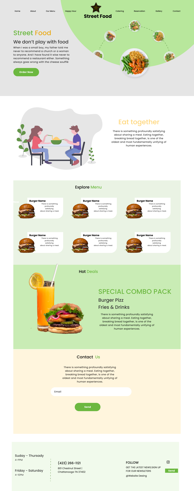

# StreetFood
This project is a StreetFood website using html and CSS. It is a project that showcases works of a a street food restaurant

link to the deployment :
```
https://mwangelee.github.io/StreetFood/
```
## Tools
This project was built with the followimng:

1. HTML
2. CSS

## Pre-requisites

in order to run this website you will need the following

- Linux/Windows/MacOS
- Browser
- internet
- Code Editor

## Setup

This section will guide you on how to run this website in your local machine

1. Clone this repo to your local machine
On your computer open the `terminal`(Linux/MacOS) or `GitBash`(windows)

```
git clone https://github.com/MwangeLee/StreetFood.git
```
2. change to your working directory
```
cd StreetFood

```
3. Open in Visual Studio Code
```
code .
```
4. Run on the browser by opening `liveserver`

## Screenshots



## Author
This project was built and is maintained by:
- Levin Mwange

## Known Issues
Am still working on the responsive nature of the website

## License 
This project has been distributed under the MIT license
```
Copyright 2023 Levin Mwange

Permission is hereby granted, free of charge, to any person obtaining a copy of this software and associated documentation files (the “Software”), to deal in the Software without restriction, including without limitation the rights to use, copy, modify, merge, publish, distribute, sublicense, and/or sell copies of the Software, and to permit persons to whom the Software is furnished to do so, subject to the following conditions:

The above copyright notice and this permission notice shall be included in all copies or substantial portions of the Software.

THE SOFTWARE IS PROVIDED “AS IS”, WITHOUT WARRANTY OF ANY KIND, EXPRESS OR IMPLIED, INCLUDING BUT NOT LIMITED TO THE WARRANTIES OF MERCHANTABILITY, FITNESS FOR A PARTICULAR PURPOSE AND NONINFRINGEMENT. IN NO EVENT SHALL THE AUTHORS OR COPYRIGHT HOLDERS BE LIABLE FOR ANY CLAIM, DAMAGES OR OTHER LIABILITY, WHETHER IN AN ACTION OF CONTRACT, TORT OR OTHERWISE, ARISING FROM, OUT OF OR IN CONNECTION WITH THE SOFTWARE OR THE USE OR OTHER DEALINGS IN THE SOFTWARE.

Join Us
Mastodon
 
Twitter
 
```
